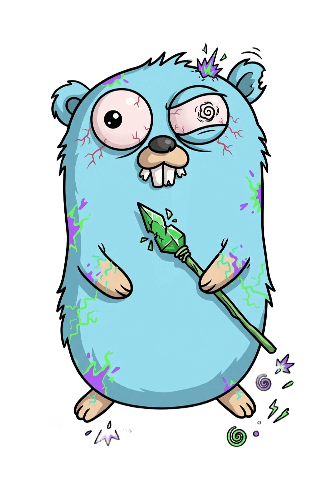

<p align="center">
  
</p>

# Goblin

**Mutation Testing for Go**

Goblin analyzes your Go source code, generates syntactic mutations, runs your tests against each mutant, and reports which survived — exposing gaps in your test suite.

## Installation

### CLI

```bash
go install github.com/joao-zip/goblin/cmd/goblin@latest
```

### Library

```bash
go get github.com/joao-zip/goblin/pkg/goblin
```

## Quick Start

```bash
# Run mutation testing on the current directory
goblin

# Target a specific project
goblin --dir ./my-project

# Enforce a minimum mutation score in CI
goblin --dir ./my-project --threshold 80

# Export results as JSON
goblin --dir ./my-project --output report.json

# Generate an interactive HTML report
goblin --dir ./my-project --html report.html

# Show version
goblin --version
```

## CLI Flags

| Flag          | Default       | Description                                      |
|---------------|---------------|--------------------------------------------------|
| `--dir`       | `.`           | Directory of the project to test                 |
| `--timeout`   | `10s`         | Timeout for each test execution                  |
| `--mutators`  | (all)         | Comma-separated list of mutators to run          |
| `--threshold` | `0`           | Minimum mutation score (%), exits 1 if below     |
| `--output`    |               | Output file path for JSON report                 |
| `--html`      |               | Output file path for interactive HTML report     |
| `--workers`   | `NumCPU()`    | Number of parallel workers                       |
| `--verbose`   | `false`       | Enable verbose logging                           |
| `--version`   |               | Print version information and exit               |

## Using as a Library

Goblin can be embedded in your own Go programs:

```go
package main

import (
    "fmt"
    "log"
    "time"

    "github.com/joao-zip/goblin/pkg/goblin"
)

func main() {
    result, err := goblin.Run(goblin.Options{
        Dir:       "./my-project",
        Timeout:   30 * time.Second,
        Workers:   4,
        Threshold: 80.0,
    })

    // ThresholdError is returned when score < threshold,
    // but result is still populated with all data.
    if thErr, ok := err.(*goblin.ThresholdError); ok {
        fmt.Printf("Score %.2f%% is below threshold %.2f%%\n",
            thErr.Score, thErr.Threshold)
    } else if err != nil {
        log.Fatal(err)
    }

    fmt.Printf("Total: %d | Killed: %d | Survived: %d | Score: %.2f%%\n",
        result.Summary.Total,
        result.Summary.Killed,
        result.Summary.Survived,
        result.Score,
    )

    for _, m := range result.Mutants {
        fmt.Printf("  [%s] %s:%d — %s → %s\n",
            m.Status, m.File, m.Line, m.Original, m.Replacement)
    }
}
```

## Supported Mutators

| Mutator        | Mutations                                          |
|----------------|-----------------------------------------------------|
| `arithmetic`   | `+` ↔ `-`, `*` ↔ `/`, `%` ↔ `*`                   |
| `comparison`   | `==` ↔ `!=`, `<` ↔ `>=`, `>` ↔ `<=`               |
| `logical`      | `&&` ↔ `\|\|`                                       |
| `unary`        | `++` ↔ `--`                                         |
| `assignment`   | `+=` ↔ `-=`, `*=` ↔ `/=`                           |

## Ignoring Code

Use `// goblin:ignore` to prevent mutation of specific lines.

**Inline** — ignores the expression on the same line:
```go
result := a + b // goblin:ignore
```

**Standalone** — ignores the line immediately below:
```go
// goblin:ignore
result := a + b
```

## CI Integration

### GitHub Actions

```yaml
- name: Mutation Testing
  run: |
    go install github.com/joao-zip/goblin/cmd/goblin@latest
    goblin --dir . --threshold 80 --output mutation-report.json
```

### Makefile

```makefile
mutation:
	goblin --dir . --threshold 80
```

## Credits & Attribution

The Go gopher was originally designed by [Renee French](http://reneefrench.blogspot.com/) and is licensed under the [Creative Commons 3.0 Attribution license](https://creativecommons.org/licenses/by/3.0/). The Goblin logo is a customized adaptation of the original Go gopher.

## License

[MIT](LICENSE)